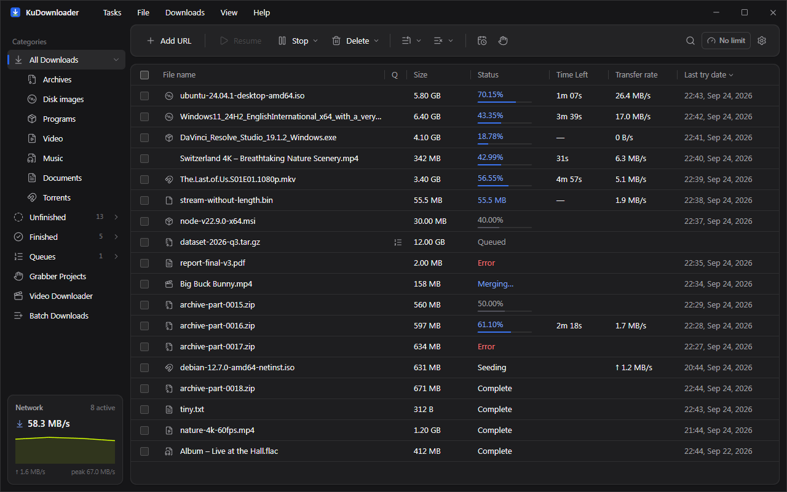
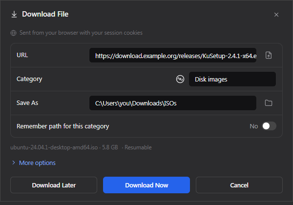
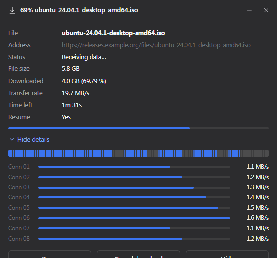

# KuDownloader

A lightweight download manager for **Windows, macOS and Linux**: a Rust core
with its own adaptive HTTP engine (KuHTTP), aria2 for torrents/FTP, yt-dlp for
media, a compact Tauri UI and a browser extension that hands downloads and
videos to the app. Free and open source.

**[Download](https://github.com/kuduyDigital/ku-download-manager/releases/latest)** ·
**[Project page](https://kuduydigital.github.io/ku-download-manager/)**



| Download File window (browser downloads) | Progress window |
|---|---|
|  |  |

## Download

| System | Package |
|---|---|
| Windows 10/11 x64 | `KuDownloader_<v>_x64-setup.exe` (per-user, no admin) |
| Debian / Ubuntu | `KuDownloader_<v>_amd64.deb`, `…_arm64.deb` |
| Fedora / openSUSE | `KuDownloader-<v>-1.x86_64.rpm`, `…aarch64.rpm` |
| Arch | `kudownloader-<v>-1-x86_64.pkg.tar.zst` (`pacman -U`) |
| Android 7+ | `KuDownloader_<v>_android-arm64-v8a.apk` (most phones), `…armeabi-v7a.apk`, `…x86_64.apk`, `…universal.apk` |

Unsigned builds: on Windows SmartScreen may ask for “More info → Run anyway”.
yt-dlp and FFmpeg are
downloaded on demand from their official releases (SHA-256 verified); aria2 is
bundled on Windows and used from the system (`apt/dnf/pacman/brew install
aria2`) elsewhere — plain HTTP(S) works without it.

## Features

* **KuHTTP** adaptive multi-connection engine (default), resume after crash or
  reboot, aria2 for FTP/SFTP/BitTorrent/magnet/Metalink.
* **Browser takeover** with an IDM-style always-on-top *Download File* window,
  a **KuDownload** button on videos on any site (iframes, fullscreen, YouTube
  previews), right-click “Download all links”.
* **Progress window** per download with speed, time left and a live
  connection/segment map; **duplicate detection**; **Download again**.
* Google Drive / Dropbox / SourceForge / GitHub links and landing pages are
  resolved to the real file.
* Queues, schedules, speed profiles, shut down/sleep when done, and
  **synchronization** queues that re-download files changed on the server.
* Video/audio downloads via yt-dlp (qualities, playlists, subtitles), cookies
  from the extension, a cookies.txt file or a browser's store.
* **KuAirSend**: send files, folders, text and links between KuDownloader on
  your computers over your own Wi-Fi or network, at full speed, encrypted, no
  cloud. Nearby devices show up as 8-bit animals; a received link downloads in
  one click. Off until you switch it on.
* Optional **virus scan** of finished files (Microsoft Defender or any scanner).
* Native title bar per platform: Windows, macOS traffic lights, GNOME, KDE,
  Cinnamon, XFCE, MATE, and tiling compositors (niri, Hyprland, Sway, i3).
* Light/dark, 8 accent colours, graphite/midnight/OLED dark palettes, English
  and 11 more languages (including Arabic, right to left); responsive down to
  the minimum window size.

```
Browser ── KuDownloader extension ── Native Messaging ── ku-native-host
                                                              │ (local API, token)
ku CLI ──────────────────────────────────────────────────────┤
                                                              ▼
Desktop app (Tauri) ── IPC ──▶ KuCore ──┬─▶ aria2   HTTP(S) · FTP · SFTP · BitTorrent · magnet · Metalink
                                        ├─▶ yt-dlp  media sites · HLS/DASH (FFmpeg for merging)
                                        └─▶ KuHTTP  native adaptive HTTP engine (default for HTTP/HTTPS)
                                        │
                                        └── SQLite (state, queues, schedules, settings)
```

## Repository

| Path | What |
|---|---|
| `crates/kucore` | Engine: SQLite persistence, aria2 supervisor + JSON-RPC, yt-dlp runner, queue/scheduler, smart connections, retries, crash recovery, local API, native-host registration, power actions, **KuHTTP** (`src/kuhttp`) |
| `crates/ku-proto` | Shared types, paths, dependency-free loopback API client and app launcher |
| `crates/ku-native-host` | Native messaging host (whitelisted requests only) |
| `crates/ku-cli` | `ku` command-line tool |
| `app/` | Tauri 2 shell (`src-tauri`) and React UI (`src`, design tokens in `src/design-system`) |
| `extension/` | WebExtension (Chromium browsers, Firefox and forks): interception, context menus, media detection, hover button with site adapters; store listing kit in `extension/STORE.md` |
| `packaging/` | Arch `PKGBUILD` and Flatpak manifest (built from the .deb in CI) |
| `docs/site` | Project page and privacy policy (GitHub Pages) |
| `docs/benchmarks` | KuHTTP vs aria2 results |

## Build and run

Requirements: Rust (stable), Node 22+, pnpm, and on Windows the MSVC build
tools. `aria2c` on `PATH` for torrents/FTP (winget `aria2.aria2`, distro
packages, `brew install aria2`); yt-dlp and FFmpeg can be installed from the app.

```bash
cd app && pnpm install && pnpm tauri dev      # desktop app (dev)
cd extension && node build.mjs                # extension → extension/dist/{chrome,firefox}
cargo build --release -p ku-cli -p ku-native-host
```

**Browser Integration** in the app lists every installed browser — anything
registered with Windows (Chrome, Edge, Brave, Helium, Opera, Vivaldi, Zen,
Floorp, …) plus known install folders — and installs the extension per browser
or in all of them: it opens the browser's extensions page and copies the
extension folder path for *Load unpacked*. The native host is registered where
each browser actually reads it (e.g. `HKCU\Software\imput\Helium\NativeMessagingHosts`),
under the current user, at startup and before each install.

Chromium browsers on Windows refuse `.crx` files that don't come from their
web store (`CRX_REQUIRED_PROOF_MISSING`), so `kudmx.crx` is for store upload or
policy deployment; *Load unpacked* is the direct path. Release Firefox installs
only Mozilla-signed add-ons permanently (`npm run sign:firefox` in `extension/`
with AMO API keys); otherwise use *Load Temporary Add-on*. The Chromium
extension id is fixed by the manifest key (`bmbpbbaapbbelemahbmnjhppdlpdgkdi`).

Downloads caught in the browser open a small always-on-top **Download File**
window (the main window can stay in the tray). On any site the extension shows
a **KuDownload** button over videos — on hover, and for a few seconds when a
video starts playing — including players inside iframes and in fullscreen.

### CLI

```bash
ku add https://example.com/file.iso -c smart
ku media "https://www.youtube.com/watch?v=…" --quality 1080
ku info "https://vimeo.com/…"
ku list · ku pause all · ku resume <id> · ku wait <id> · ku queue start main
```

The CLI starts the app in the tray if it is not running (`--no-launch` to disable).

## Tests

```bash
cargo test --workspace --release
```

* `kucore` unit tests (classification, filenames, DB, torrent parser, smart
  controller, hashing, grabber, KuHTTP components).
* `tests/engine.rs` — real aria2 against a local range server: checksum,
  rename-on-conflict, pause/resume integrity, queue ordering and concurrency,
  404 handling, crash recovery, delete-with-files.
* `tests/kuhttp.rs` — KuHTTP failure-injection suite (32 scenarios; see below).
* `tests/core_kuhttp.rs` — KuCore driving KuHTTP (routing, pause/resume,
  restart recovery).

## Packaging

```bash
cd extension && node build.mjs && node pack.mjs   # unpacked builds, dist/packages (kudmx.xpi, kudmx.crx), store zip
node scripts/prepare-sidecars.mjs [--target <triple>]   # ku-native-host, ku (+ aria2c on Windows)
cd app && pnpm tauri build --config src-tauri/tauri.bundle.conf.json          # Windows .exe (NSIS)
cd app && pnpm tauri build --config src-tauri/tauri.bundle.linux.conf.json    # Linux .deb / .rpm
cd app && pnpm tauri build --config src-tauri/tauri.bundle.macos.conf.json    # macOS .dmg / .app
```

CI (`.github/workflows/ci.yml`) runs the tests on Windows, Linux and macOS.
Pushing a `v*` tag builds into a **draft** GitHub release: Windows `.exe`;
Linux x86_64 and arm64 `.deb`/`.rpm`; an Arch package (`packaging/arch/PKGBUILD`)
built from the `.deb`; and the Android APKs.

Optional repository secrets (each feature switches on when its secrets exist):

| Secret(s) | Enables |
|---|---|
| `TAURI_SIGNING_PRIVATE_KEY` (+ `_PASSWORD`) | auto-update: signed updater artifacts and `latest.json` (key in `.secrets/updater.key`) |
| `KU_EXTENSION_KEY` | `kudmx.crx` in the installers (PEM of `.secrets/extension-key.pem`) |
| `WINDOWS_CERTIFICATE` (base64 .pfx) + `WINDOWS_CERTIFICATE_PASSWORD` | Authenticode-signed Windows installer (no SmartScreen warning) |
| `APPLE_CERTIFICATE`, `APPLE_CERTIFICATE_PASSWORD`, `APPLE_SIGNING_IDENTITY`, `APPLE_ID`, `APPLE_PASSWORD`, `APPLE_TEAM_ID` | signed and notarized macOS app |
| `AMO_JWT_ISSUER` + `AMO_JWT_SECRET` | Mozilla-signed `kudmx.signed.xpi` attached to each release (permanent Firefox install) |
| `CWS_EXTENSION_ID`, `CWS_CLIENT_ID`, `CWS_CLIENT_SECRET`, `CWS_REFRESH_TOKEN` | Chrome Web Store upload + publish on each release |

Store listing text, permission justifications and the privacy policy:
[`extension/STORE.md`](extension/STORE.md). The update feed URL defaults to
GitHub releases and can be changed in Settings › Advanced.

## Security model

* The local API listens on 127.0.0.1 only, requires a per-run bearer token
  (stored in the per-user data folder), rejects requests carrying an `Origin`
  header and foreign `Host` headers.
* The native host accepts a fixed set of request types and only http, https,
  ftp, sftp and magnet URLs; it can start KuDownloader and nothing else.
* Downloaded files are never opened automatically. DRM-protected media is
  detected and refused.
* Credentials and cookies are sent only to the origin they belong to; KuHTTP
  strips them on cross-origin redirects.
* KuAirSend opens a network port (53318) only while it is switched on. Only
  KuDownloader devices take part. Every connection is mutual TLS with each
  device's own certificate, checked by its SHA-256 fingerprint on both ends.
  Nothing is saved until you accept, unless you trusted that device, turned on
  auto-accept or set a PIN the sender knows. Received names are confined to the
  receive folder and never overwrite existing files.

## KuHTTP

KuHTTP is KuDownloader's own HTTP engine (`crates/kucore/src/kuhttp`): real
range probing, a live segment map with work stealing, an adaptive connection
controller, strict `Content-Range` validation, ETag / Last-Modified / sampled
content checks on resume, fsync-before-persist crash safety, checksum
verification and atomic finalize. After passing all 32 failure-injection
scenarios and the aria2 benchmarks it is the **default HTTP/HTTPS engine for
new installs** (aria2 remains selectable in Settings › Advanced › HTTP
engine). Details and results: [`docs/kuhttp.md`](docs/kuhttp.md).

## License

MIT — see [LICENSE](LICENSE).
